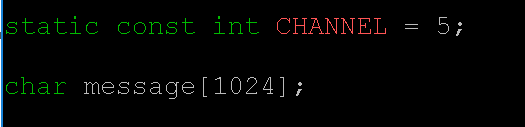
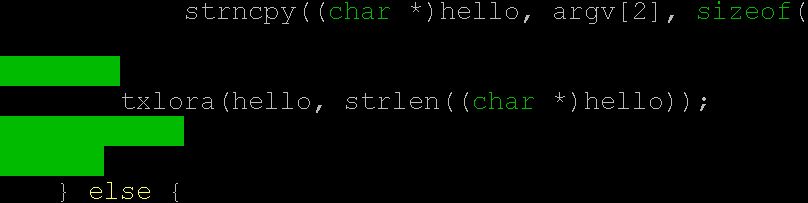
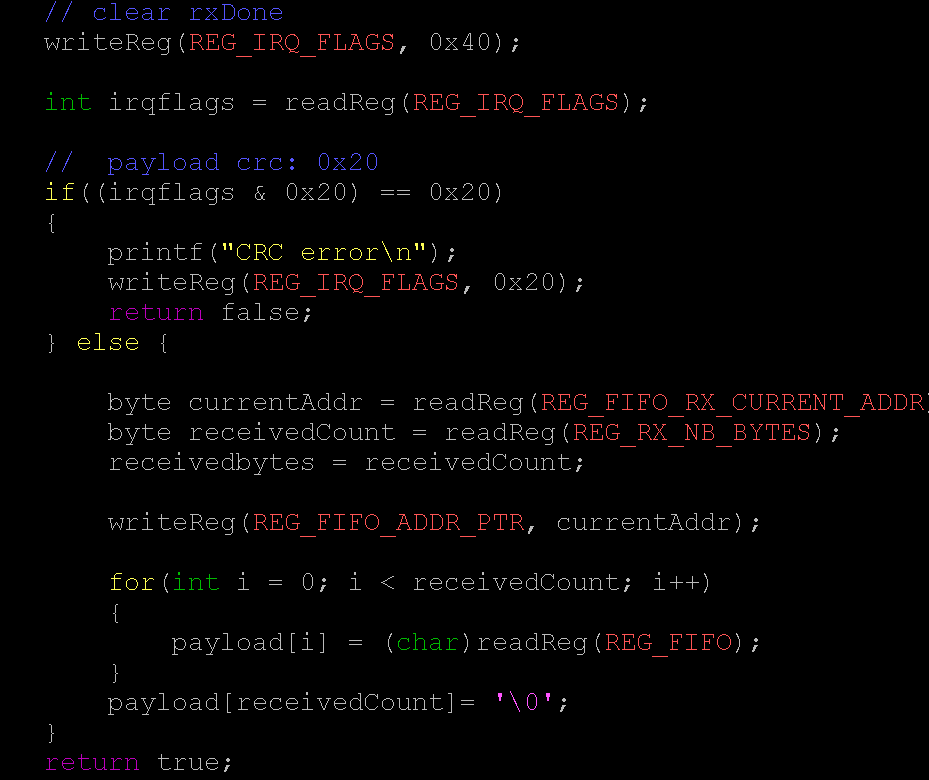
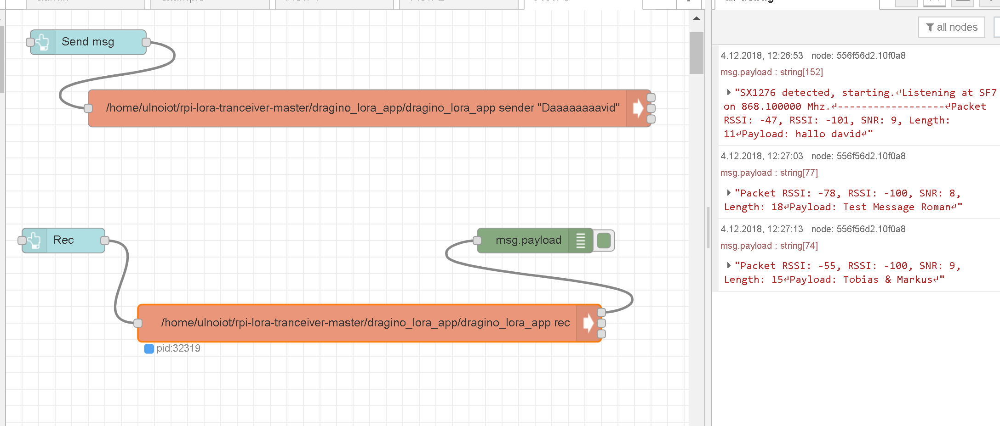
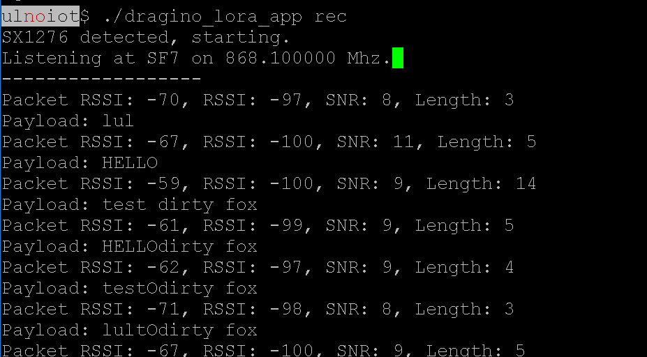

# Lab 9

#### LoRa
* Setup LoRa shield on pi and made [EXAMPLE 3](http://wiki.dragino.com/index.php?title=Lora/GPS_HAT) without any problems

* In main.c you can change the channel and the size of the message

* Alter following code (PICTURE)

#### TTN

I tried to setup TTN for at least 3hours, with the given links from the lecture, specially the http://wiki.dragino.com/index.php?title=Connect_to_TTN. I couldn find the right example and tried nearly every one. Without success. Created an account in TTN but had no idea how to connect the device to the account?
