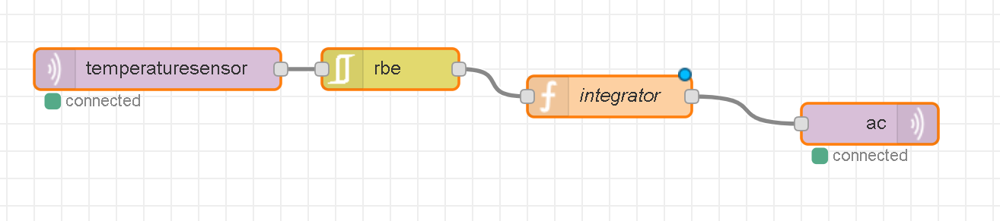

# Lab 5
## NodeRed
* Build system: Read temperature sensor and react (use MQTT simulators) 
Therefore i used my temperature sensor and the ac-switch and build a simpe Node-RED flow.
The javascript code for the function was:
```javascript
  if(parseInt(msg.payload,10) >= 10) {
    msg.payload = 1;
  }
  else {
    msg.payload = 0;
  }
  return msg;
```
if the tempsensor writes a value bigger/equal 10 to the mqtt channel, 
the function reacts and sends the value 1 to the ac channel and the ac-simulator switches to "on".

[Code for temperaturesensor](https://github.com/Witzeneder/IoT/blob/master/%C3%9Cbungen/20_Nov_2018/tempsensor.py)

[Code for ac-switch](https://github.com/Witzeneder/IoT/blob/master/%C3%9Cbungen/20_Nov_2018/acswitch.py)


