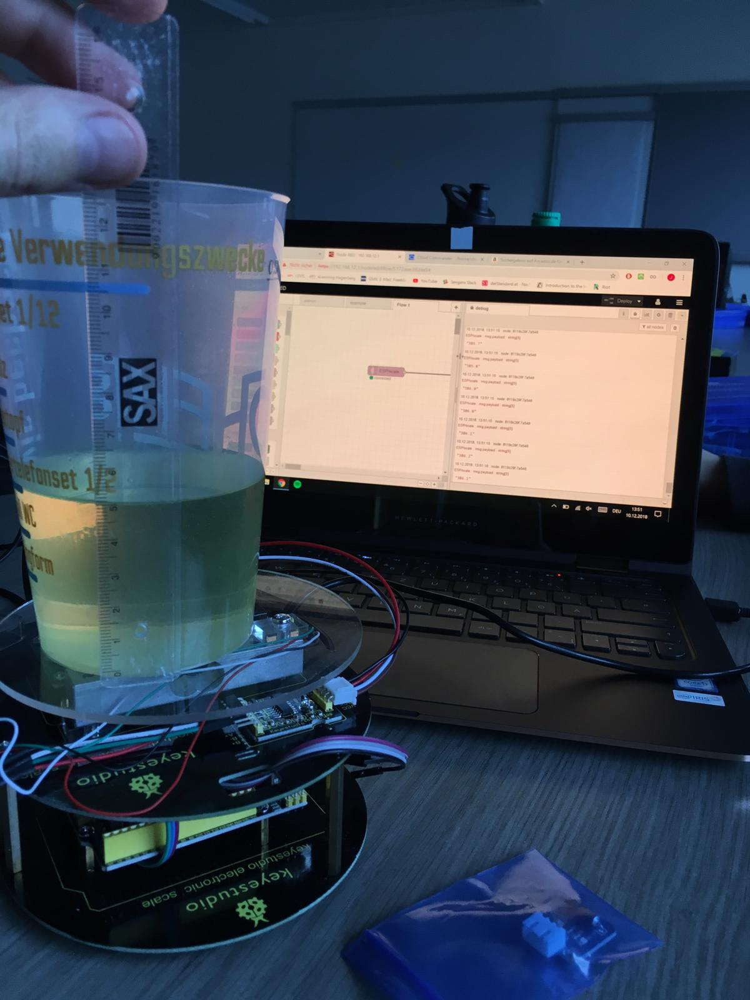
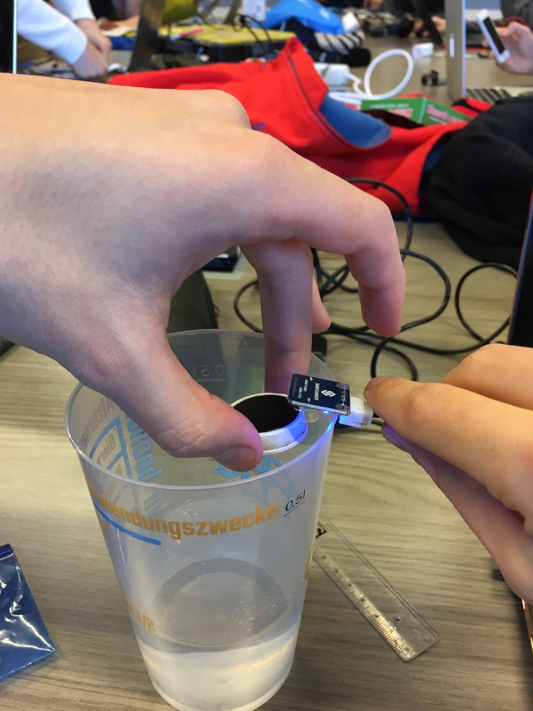
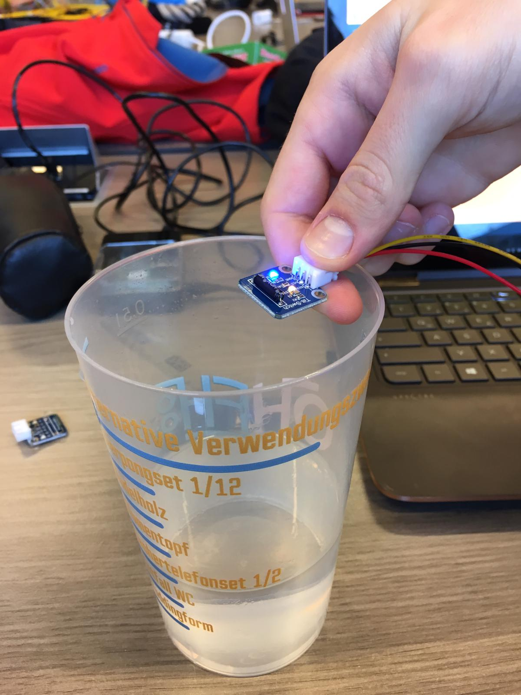

# Project 2 - Protocol

* ulnoIoT used for project 2
* cup was filled with 5 cm of fluid in fh cup (diameter ca. 6,5cm on buttom - every fluid water,dirty water, oil)

### Scale
`hx711(scale, D1, D2, 450, false);`

* Oil -> 380g
* Water -> 380g
* dirty Water -> 420g

###### Thoughts

* Scale is of good use when measuring the amount of used fluid, each fluid has its own weight factor which is needed to be able to calculate the volume.

### Raindrop
`analog(hum).with_precision(10);`

* Oil -> 1022 9/10 inside
* Water -> 274 9/10 inside
* dirty Water -> 272 9/10 inside

###### Thoughts

* This shows that the raindrop sensor is of very good use, when detecting any kind of water.
* On the other hand oil isn't detected since the sensor doesnt register it as "wet".

### Ultrasonic
`hcsr04(ulti, D1, D2).with_precision(10);`

* Oil -> 161mm
* Water -> 166mm
* dirty Water -> 165mm

With lineal measured: 160mm

### Reed Switch
`input(reed_switch, D3);`

* magnetic field
* Oil -> on/off check
* Water -> on/off check
* dirty Water -> on/off check

* magnet on water level and when water level to high -> magnet close to sensor -> off check

### Tilt Switch
`input(tilt_switch, D3);`

* Oil -> on/off check
* Water -> on/off check
* dirty Water -> on/off check

* sensor detects movement -> when water isn't static (moves around) it senses it and reports.

###### Thoughts

* The ultrasonic sensor is able to give the correct value, it doesn't matter which fluid is used.
* To get a valid value we took a lineal and put it on the cup to have a aid for measuring from the same distance.

### Time of flight
`Distance_Vl53l0x(tof, <optional long range bool>, optional highaccuracy bool>);`

* Oil -> 140mm
* Water -> 130mm - 160mm
* dirty Water -> 145mm

With lineal measured: 140mm

###### Thoughts

* The time of flight sensor is of good use with oil and dirty water (varies with +/-10mm),
* but when used clear water it varies +-30mm.
* To get a valid value we took a lineal and put it on the cup to have a aid for measuring from the same distance.

### Summary

The scale worked quite good for any kind of liquids. The only disadvantage is that it is quite huge comparing to the other sensors.

The Raindrop Sensor is also a good solution for Water. It works like a float. The problem is, that the raindrop sensor cannot conduct electricity in oil.

The Ultrasonic sensor works quite exactly. The only struggle is when using a small container, then the sensor might fail, if the liquid is too near.

The Time of flight sensor was one of the best sensors, and worked on every liquid very exactly. Only with water the values varied a little bit.

##### Recommendations

* Water -> Scale (costs?) or (sensor is vertical from bottom to top)

* Dirty Water -> Time of flight (if measurements vary a lot the water is dirty) or raindrop (sensor is vertical from bottom to top)

* Oil -> Scale

Ultrasonic can be used with all 3, if the tank isn't moved a lot and sensor has a certain distance to the liquid (to function properly)
